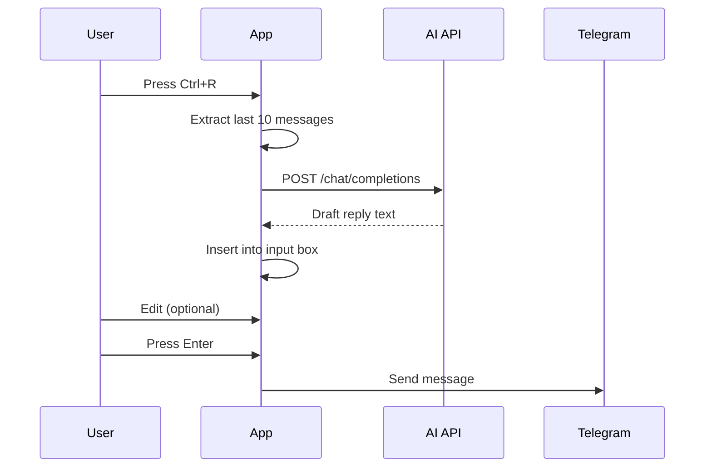

# Vimgram AI Features Implementation Plan

This document outlines the implementation strategy for three major AI-powered features in Vimgram.

---

## Overview

| Feature | Description | Priority |
|---------|-------------|----------|
| **Command Assistant** | Natural language commands (e.g., "mute for 2 hours") | High |
| **Coding Assistant** | Code snippets, debugging, explanations | Medium |
| **Smart Reply Drafting** | AI-generated replies based on context | High |

### AI Backend: GLM-4 (via Z.ai API)

- **Model**: GLM-4-Flash (free tier) or GLM-4.7 (advanced)
- **API**: OpenAI-compatible endpoint at `https://open.bigmodel.cn/api/paas/v4/`
- **Config**: Store API key in `~/.config/vimgram/ai.json` or `.env`
- **Crate**: Use `reqwest` for HTTP requests (already async with tokio)

---

## Feature 1: Command Assistant

### Concept
Users can type natural language commands prefixed with `:ai` and the AI translates them into Telegram actions.

### Example Commands
| User Input | Parsed Action |
|-----------|---------------|
| `:ai mute this chat for 2 hours` | Call `account.updateNotifySettings` with 7200s mute |
| `:ai find last message from Alice about meeting` | Search message history with filters |
| `:ai mark all as read` | Iterate dialogs and mark read |
| `:ai send "hello" to @john` | Resolve username + send message |

### Implementation Steps

#### 1. Add AI Configuration Module
```
src/ai/
├── mod.rs          # Module exports
├── config.rs       # Load API key from config file
├── client.rs       # HTTP client for GLM API calls
└── commands.rs     # Command parsing and execution
```

#### 2. Define Command Schema
Create a structured prompt for the AI:
```
You are a Telegram command parser. Convert natural language to JSON actions.
Available actions:
- {"action": "mute", "chat_id": <current|id>, "duration_seconds": <int>}
- {"action": "search_messages", "query": "<text>", "from_user": "<optional>"}
- {"action": "send_message", "to": "<username>", "text": "<message>"}
- {"action": "mark_read", "chat_id": <current|all>}

User command: "{input}"
Respond with ONLY valid JSON.
```

#### 3. Execute Parsed Commands
- Parse AI JSON response → match action type → call grammers API
- For muting: Use `client.invoke(functions::account::UpdateNotifySettings { ... })`
- For search: Use `client.search_messages()` or iterate with filters

#### 4. UI Integration
- New mode: `Mode::AICommand`
- Input prefix: `:ai `
- Show "Thinking..." overlay while API processes
- Display result/confirmation in status bar

### Telegram API Methods Required
| Action | Telegram Method |
|--------|-----------------|
| Mute notifications | `account.updateNotifySettings` |
| Search messages | `messages.search` |
| Mark as read | `messages.readHistory` |
| Get user info | `users.getFullUser` |

---

## Feature 2: Integrated Coding Assistant

### Concept
A dedicated coding mode (`:code`) that allows quick code generation, explanation, and debugging without leaving the terminal.

### Example Interactions
- `:code explain this rust borrowing error`
- `:code write a python function to parse JSON`
- `:code debug: why does this segfault`

### Implementation Steps

#### 1. Add Code Mode
```rust
pub enum Mode {
    // ... existing modes
    Code,  // For coding assistant
}
```

#### 2. Create Code Overlay UI
- Full-screen overlay (like account picker but larger)
- Split view: Input (bottom) | Output (top, scrollable)
- Syntax highlighting for code blocks (parse markdown code fences)

#### 3. Code-Specific Prompt
```
You are a coding assistant integrated into a terminal app.
- Respond concisely
- Use markdown code blocks with language tags
- For debugging, ask clarifying questions if needed

User: {input}
```

#### 4. Stream Response (Optional Enhancement)
- Use streaming API for real-time token display
- Show typing indicator while generating

### UI Wireframe
```
╭─ Code Assistant ────────────────────────────────╮
│ ```rust                                         │
│ fn main() {                                     │
│     let x = vec![1, 2, 3];                      │
│     println!("{:?}", x);                        │
│ }                                               │
│ ```                                             │
│                                                 │
│ This creates a vector and prints it. The {:?}  │
│ formatter uses Debug trait for output.          │
├─────────────────────────────────────────────────┤
│ > explain vec! macro in rust                    │
╰─────────────────────────────────────────────────╯
```

---

## Feature 3: Smart Reply Drafting

### Concept
Press a keybinding (e.g., `Ctrl+R`) to generate a contextual reply draft based on recent chat history.

### Example Scenarios
| Chat Context | Generated Draft |
|--------------|-----------------|
| "Can you review my PR by tomorrow?" | "Sure, I'll take a look at it tonight and leave comments by tomorrow morning." |
| "Hey, what's the status on the deployment?" | "The deployment is currently in progress. I'll update you once it's complete." |
| Technical question about code | Generates technical explanation |

### Implementation Steps

#### 1. Context Extraction
```rust
fn get_reply_context(app: &App, max_messages: usize) -> String {
    // Get last N messages from current chat
    // Format: "User: message\nYou: message\n..."
}
```

#### 2. Reply Generation Prompt
```
You are helping draft a reply in a chat application.
Given the chat history, generate a helpful, concise reply.
Match the tone of the conversation (casual/professional).
Do NOT include greetings unless the conversation warrants it.

Chat history:
{context}

Draft a reply:
```

#### 3. UI Integration
- Keybinding: `Ctrl+R` in Normal mode when in Chat panel
- Show overlay: "Generating reply..."
- Insert draft into input box (user can edit before sending)
- User presses Enter to send or Esc to discard

#### 4. Tone Selector (Optional)
- `:reply formal` - Generate professional reply
- `:reply casual` - Generate friendly reply
- `:reply technical` - Generate detailed technical reply

### Flow Diagram


---

## Shared Infrastructure

### AI Client Module (`src/ai/client.rs`)
```rust
pub struct AIClient {
    http_client: reqwest::Client,
    api_key: String,
    base_url: String,
    model: String,
}

impl AIClient {
    pub async fn complete(&self, prompt: &str) -> Result<String, AIError>;
    pub async fn complete_json<T: DeserializeOwned>(&self, prompt: &str) -> Result<T, AIError>;
}
```

### Configuration (`src/ai/config.rs`)
```rust
pub struct AIConfig {
    pub api_key: String,
    pub model: String,       // "glm-4-flash" or "glm-4.7"
    pub base_url: String,    // Default: Z.ai endpoint
    pub enabled: bool,
}
```

### Error Handling
- Rate limit errors → Show "Please wait..." with countdown
- Network errors → Show "AI unavailable, try again"
- Invalid responses → Fall back gracefully, log error

---

## Dependencies to Add

```toml
[dependencies]
reqwest = { version = "0.12", features = ["json"] }
serde = { version = "1.0", features = ["derive"] }
serde_json = "1.0"
```

> Note: `reqwest` and `serde_json` may already be included; verify in Cargo.toml.

---

## Implementation Order

### Phase 1: Foundation
1. Add `src/ai/` module structure
2. Implement `AIClient` with basic completion
3. Add API key configuration flow
4. Test with simple prompt

### Phase 2: Command Assistant
1. Add `:ai` command handler
2. Implement command parsing prompt
3. Add JSON response parsing
4. Implement mute/search/send actions
5. Test with real Telegram API calls

### Phase 3: Smart Reply
1. Add `Ctrl+R` keybinding
2. Implement context extraction
3. Add reply generation
4. Insert draft into input

### Phase 4: Coding Assistant
1. Add `:code` mode
2. Build overlay UI with syntax highlighting
3. Implement streaming (optional)
4. Add response caching

---

## Open Questions for User

1. **API Key Source**: Should we use GLM-4-Flash (free) or allow users to configure their own API key for GLM-4.7?

2. **Privacy**: Should AI features be opt-in? (Some users may not want chat context sent to external API)

3. **Rate Limits**: Should we implement local caching for repeated queries?

4. **Smart Reply Trigger**: Is `Ctrl+R` acceptable, or prefer a command like `:reply`?

---

## Timeline Estimate

| Phase | Effort | Features |
|-------|--------|----------|
| Phase 1 | 2-3 hours | AI client, config |
| Phase 2 | 4-5 hours | Command Assistant |
| Phase 3 | 2-3 hours | Smart Reply |
| Phase 4 | 3-4 hours | Coding Assistant |
| **Total** | **~12-15 hours** | All features |
